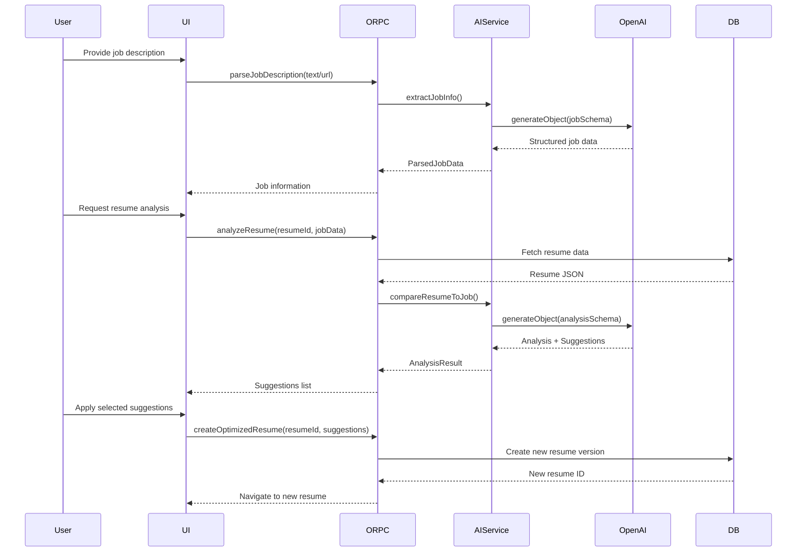

# Design Document

## Overview

The AI Resume and Cover Letter Assistant is an intelligent feature that helps students optimize their resumes and generate personalized cover letters for job applications. The system uses the Vercel AI SDK to analyze job descriptions, compare them against resume data, and provide actionable suggestions for improvement.

The feature integrates seamlessly with the existing Career Space, building on top of the job application tracking and resume builder systems. It introduces AI-powered analysis capabilities while maintaining the existing data structures and user workflows.

## Architecture

### High-Level Architecture

```
┌─────────────────────────────────────────────────────────────┐
│                        Web Client                            │
│  ┌──────────────┐  ┌──────────────┐  ┌──────────────┐      │
│  │ Job Input    │  │ Suggestions  │  │ Cover Letter │      │
│  │ Component    │  │ Review UI    │  │ Editor       │      │
│  └──────────────┘  └──────────────┘  └──────────────┘      │
└─────────────────────────────────────────────────────────────┘
                            │
                            │ ORPC
                            ▼
┌─────────────────────────────────────────────────────────────┐
│                      Server (Hono)                           │
│  ┌──────────────────────────────────────────────────────┐   │
│  │              AI Assistant Service                     │   │
│  │  ┌────────────┐  ┌────────────┐  ┌────────────┐     │   │
│  │  │ Job Parser │  │ Resume     │  │ Cover      │     │   │
│  │  │            │  │ Analyzer   │  │ Letter Gen │     │   │
│  │  └────────────┘  └────────────┘  └────────────┘     │   │
│  └──────────────────────────────────────────────────────┘   │
│                            │                                 │
│                            │ Vercel AI SDK                   │
│                            ▼                                 │
│  ┌──────────────────────────────────────────────────────┐   │
│  │              OpenAI GPT-4o-mini                       │   │
│  └──────────────────────────────────────────────────────┘   │
└─────────────────────────────────────────────────────────────┘
                            │
                            ▼
┌─────────────────────────────────────────────────────────────┐
│                    PostgreSQL Database                       │
│  ┌──────────────┐  ┌──────────────┐  ┌──────────────┐      │
│  │ resumes      │  │ job_         │  │ cover_       │      │
│  │              │  │ applications │  │ letters      │      │
│  └──────────────┘  └──────────────┘  └──────────────┘      │
└─────────────────────────────────────────────────────────────┘
```

### Component Interaction Flow



## Components and Interfaces

### 1. Job Description Input Component

**Purpose**: Allows users to provide job descriptions via URL or manual text entry.

**Props**:
```typescript
interface JobInputProps {
  onJobParsed: (jobData: ParsedJobData) => void
  onError: (error: string) => void
}
```

**State**:
```typescript
interface JobInputState {
  inputMode: 'url' | 'text'
  urlValue: string
  textValue: string
  isParsing: boolean
  parsedData: ParsedJobData | null
}
```

**Key Methods**:
- `handleUrlParse()`: Triggers URL parsing via ORPC
- `handleTextParse()`: Triggers text parsing via ORPC
- `validateInput()`: Validates URL format or text length

### 2. Resume Analysis Component

**Purpose**: Displays analysis results and suggestions for resume optimization.

**Props**:
```typescript
interface AnalysisProps {
  resumeId: string
  jobData: ParsedJobData
  onApplySuggestions: (suggestions: string[]) => void
}
```

**State**:
```typescript
interface AnalysisState {
  isAnalyzing: boolean
  analysis: ResumeAnalysis | null
  selectedSuggestions: Set<string>
  error: string | null
}
```

**Key Methods**:
- `performAnalysis()`: Triggers AI analysis
- `toggleSuggestion(id)`: Selects/deselects suggestions
- `applySelected()`: Creates optimized resume version

### 3. Suggestion Card Component

**Purpose**: Displays individual suggestions with before/after comparison.

**Props**:
```typescript
interface SuggestionCardProps {
  suggestion: ResumeSuggestion
  isSelected: boolean
  onToggle: () => void
}
```

**Renders**:
- Section name and field being modified
- Original content
- Proposed content (with diff highlighting)
- Reasoning explanation
- Impact score indicator

### 4. Cover Letter Generator Component

**Purpose**: Generates and allows editing of cover letters.

**Props**:
```typescript
interface CoverLetterProps {
  resumeId: string
  jobData: ParsedJobData
  applicationId?: string
}
```

**State**:
```typescript
interface CoverLetterState {
  isGenerating: boolean
  content: string
  isEditing: boolean
  isSaving: boolean
}
```

**Key Methods**:
- `generateCoverLetter()`: Triggers AI generation
- `handleEdit()`: Enables editing mode
- `saveCoverLetter()`: Persists to database
- `exportToPDF()`: Downloads as PDF

### 5. AI Assistant Service (Backend)

**Purpose**: Orchestrates AI operations and manages prompts.

**Class Structure**:
```typescript
class AIAssistantService {
  // Job parsing
  async parseJobDescription(text: string): Promise<ParsedJobData>
  async parseJobUrl(url: string): Promise<ParsedJobData>

  // Resume analysis
  async analyzeResume(
    resumeData: ResumeData,
    jobData: ParsedJobData
  ): Promise<ResumeAnalysis>

  // Suggestion generation
  async generateSuggestions(
    resumeData: ResumeData,
    jobData: ParsedJobData,
    analysis: ResumeAnalysis
  ): Promise<ResumeSuggestion[]>

  // Cover letter generation
  async generateCoverLetter(
    resumeData: ResumeData,
    jobData: ParsedJobData
  ): Promise<string>

  // Helper methods
  private buildAnalysisPrompt(resume: ResumeData, job: ParsedJobData): string
  private buildSuggestionPrompt(section: string, content: any, job: ParsedJobData): string
  private buildCoverLetterPrompt(resume: ResumeData, job: ParsedJobData): string
}
```

## Data Models

### ParsedJobData

```typescript
interface ParsedJobData {
  companyName: string
  positionTitle: string
  location: string | null
  salaryRange: string | null
  description: string
  requirements: string[]
  responsibilities: string[]
  skills: string[]
  experienceYears: number | null
  educationLevel: string | null
}
```

### ResumeAnalysis

```typescript
interface ResumeAnalysis {
  matchScore: number // 0-100
  strengths: string[] // Matching skills/experience
  gaps: string[] // Missing requirements
  keywordMatches: {
    found: string[]
    missing: string[]
  }
  sectionScores: {
    [section: string]: {
      score: number
      feedback: string
    }
  }
  overallFeedback: string
}
```

### ResumeSuggestion

```typescript
interface ResumeSuggestion {
  id: string
  section: 'experience' | 'projects' | 'education' | 'basicInfo' | 'certifications'
  itemId: string | null // ID of specific item in array (e.g., experience entry)
  field: string // Specific field being modified
  originalContent: string
  proposedContent: string
  reasoning: string
  impactScore: number // 1-10
  keywords: string[] // Keywords being added/emphasized
}
```

### CoverLetter

```typescript
interface CoverLetter {
  id: string
  userId: string
  applicationId: string | null
  resumeId: string
  content: string
  createdAt: string
  updatedAt: string
}
```

### Resume Version Metadata

```typescript
// Extended resume table
interface Resume {
  // ... existing fields
  sourceResumeId: string | null // If created from another resume
  optimizedForJobId: string | null // Job application it was optimized for
  appliedSuggestions: string[] | null // IDs of applied suggestions
}
```

## Database Schema Changes

### New Table: cover_letters

```sql
CREATE TABLE cover_letters (
  id TEXT PRIMARY KEY,
  user_id TEXT NOT NULL REFERENCES users(id) ON DELETE CASCADE,
  application_id TEXT REFERENCES job_applications(id) ON DELETE SET NULL,
  resume_id TEXT NOT NULL REFERENCES resumes(id) ON DELETE CASCADE,
  content TEXT NOT NULL,
  created_at TIMESTAMP WITH TIME ZONE DEFAULT NOW(),
  updated_at TIMESTAMP WITH TIME ZONE DEFAULT NOW()
);

CREATE INDEX idx_cover_letters_user_id ON cover_letters(user_id);
CREATE INDEX idx_cover_letters_application_id ON cover_letters(application_id);
CREATE INDEX idx_cover_letters_resume_id ON cover_letters(resume_id);
```

### Resume Table Updates

```sql
ALTER TABLE resumes
ADD COLUMN source_resume_id TEXT REFERENCES resumes(id) ON DELETE SET NULL,
ADD COLUMN optimized_for_job_id TEXT REFERENCES job_applications(id) ON DELETE SET NULL,
ADD COLUMN applied_suggestions JSONB DEFAULT '[]';

CREATE INDEX idx_resumes_source_resume_id ON resumes(source_resume_id);
CREATE INDEX idx_resumes_optimized_for_job_id ON resumes(optimized_for_job_id);
```


## Correctness Properties

*A property is a characteristic or behavior that should hold true across all valid executions of a system-essentially, a formal statement about what the system should do. Properties serve as the bridge between human-readable specifications and machine-verifiable correctness guarantees.*

### Property 1: Job description text length validation

*For any* job description text input, if the length is ≤ 10,000 characters, it should be accepted; if > 10,000 characters, it should be rejected with a validation error.
**Validates: Requirements 1.4**

### Property 2: Job parser field extraction completeness

*For any* valid job description, the parser output should contain non-null values for companyName, positionTitle, and at least one of requirements, responsibilities, or skills arrays.
**Validates: Requirements 2.1, 2.2**

### Property 3: Resume analysis score bounds

*For any* resume analysis result, the matchScore field should be a number between 0 and 100 (inclusive).
**Validates: Requirements 3.4**

### Property 4: Analysis output structure completeness

*For any* completed resume analysis, the result should contain both strengths and gaps arrays, even if one or both are empty.
**Validates: Requirements 3.2, 3.3, 3.5**

### Property 5: Suggestion section validity

*For any* generated suggestion, the section field should be one of: 'experience', 'projects', 'education', 'basicInfo', or 'certifications'.
**Validates: Requirements 4.1**

### Property 6: Suggestion content completeness

*For any* suggestion, it should contain non-empty originalContent, proposedContent, and reasoning fields.
**Validates: Requirements 4.2, 5.3**

### Property 7: Suggestion keyword relevance

*For any* suggestion that includes keywords, all keywords should appear in the original job description.
**Validates: Requirements 4.3**

### Property 8: Suggestion impact score ordering

*For any* list of suggestions, they should be sorted by impactScore in descending order (highest impact first).
**Validates: Requirements 4.5**

### Property 9: Original resume preservation

*For any* resume optimization operation, after creating a new version, the original resume data should be byte-for-byte identical to before the operation.
**Validates: Requirements 6.2**

### Property 10: Applied suggestions reflection

*For any* new resume version created from suggestions, the new resume data should contain the proposedContent from all selected suggestions in the appropriate sections.
**Validates: Requirements 6.3**

### Property 11: Resume version job association

*For any* resume created via optimization, the optimizedForJobId field should match the job application ID provided during creation.
**Validates: Requirements 6.4, 15.3**

### Property 12: Resume version metadata

*For any* resume created from AI suggestions, it should have a non-null sourceResumeId pointing to the original resume.
**Validates: Requirements 7.2**

### Property 13: Cover letter content structure

*For any* generated cover letter, the content should contain at least 3 paragraphs (opening, body, closing).
**Validates: Requirements 8.2, 8.4, 8.5**

### Property 14: Cover letter experience inclusion

*For any* generated cover letter, it should mention at least one experience entry from the resume data.
**Validates: Requirements 8.3**

### Property 15: Cover letter job association

*For any* saved cover letter, if associated with a job application, the applicationId field should reference a valid job application belonging to the same user.
**Validates: Requirements 9.3, 15.4**

### Property 16: AI service retry behavior

*For any* AI request that fails with a retryable error, the system should attempt the request up to 3 times before returning an error to the user.
**Validates: Requirements 10.3**

### Property 17: AI response schema validation

*For any* AI response received, it should be validated against the expected Zod schema before being returned to the client.
**Validates: Requirements 10.5**

### Property 18: Suggestion factual accuracy

*For any* suggestion, the proposedContent should not introduce facts (dates, companies, technologies) that don't exist in the original resume data.
**Validates: Requirements 11.2**

### Property 19: Job parsing performance

*For any* job description parsing operation, it should complete within 5 seconds or return a timeout error.
**Validates: Requirements 12.1**

### Property 20: Resume analysis performance

*For any* resume analysis operation, it should complete within 10 seconds or return a timeout error.
**Validates: Requirements 12.2**

### Property 21: Cover letter generation performance

*For any* cover letter generation operation, it should complete within 15 seconds or return a timeout error.
**Validates: Requirements 12.4**

### Property 22: Network error state preservation

*For any* AI operation that fails due to network error, the user's input data (job description, selected suggestions) should be preserved in component state for retry.
**Validates: Requirements 13.3**

### Property 23: HTTPS connection enforcement

*For any* request to the AI service, the connection should use HTTPS protocol.
**Validates: Requirements 14.1**

### Property 24: Cascade deletion of AI data

*For any* resume deletion, all associated cover letters should also be deleted from the database.
**Validates: Requirements 14.4**

## Error Handling

### Error Categories

1. **Validation Errors**
   - Invalid job URL format
   - Job description text too long
   - Missing required fields in resume data
   - Invalid suggestion selection

2. **AI Service Errors**
   - API rate limiting
   - Model timeout
   - Invalid response format
   - Token limit exceeded

3. **Network Errors**
   - Connection timeout
   - DNS resolution failure
   - SSL/TLS errors

4. **Business Logic Errors**
   - Resume not found
   - Job application not found
   - Unauthorized access to resume
   - Cannot optimize already optimized resume

### Error Handling Strategy

```typescript
class AIAssistantError extends Error {
  constructor(
    message: string,
    public code: string,
    public retryable: boolean,
    public userMessage: string
  ) {
    super(message)
  }
}

// Error codes
const ERROR_CODES = {
  INVALID_URL: { retryable: false, userMessage: 'Please provide a valid URL' },
  URL_FETCH_FAILED: { retryable: true, userMessage: 'Failed to fetch job posting. Please try again.' },
  AI_TIMEOUT: { retryable: true, userMessage: 'Analysis is taking longer than expected. Please try again.' },
  AI_RATE_LIMIT: { retryable: true, userMessage: 'Too many requests. Please wait a moment and try again.' },
  INVALID_RESPONSE: { retryable: true, userMessage: 'Received invalid response. Please try again.' },
  RESUME_NOT_FOUND: { retryable: false, userMessage: 'Resume not found.' },
  UNAUTHORIZED: { retryable: false, userMessage: 'You do not have permission to access this resume.' }
}
```

### Retry Logic

```typescript
async function withRetry<T>(
  operation: () => Promise<T>,
  maxRetries: number = 3,
  baseDelay: number = 1000
): Promise<T> {
  let lastError: Error

  for (let attempt = 0; attempt < maxRetries; attempt++) {
    try {
      return await operation()
    } catch (error) {
      lastError = error as Error

      // Don't retry non-retryable errors
      if (error instanceof AIAssistantError && !error.retryable) {
        throw error
      }

      // Exponential backoff
      if (attempt < maxRetries - 1) {
        const delay = baseDelay * Math.pow(2, attempt)
        await new Promise(resolve => setTimeout(resolve, delay))
      }
    }
  }

  throw lastError!
}
```

## Testing Strategy

### Unit Testing

Unit tests will cover:

1. **Job Parser**
   - Parsing various job description formats
   - Extracting structured data from text
   - Handling malformed input
   - URL validation

2. **Suggestion Generator**
   - Generating suggestions for different resume sections
   - Keyword extraction and matching
   - Impact score calculation
   - Suggestion prioritization

3. **Resume Optimizer**
   - Applying suggestions to resume data
   - Creating new resume versions
   - Preserving original resume data
   - Metadata association

4. **Cover Letter Generator**
   - Content structure validation
   - Experience inclusion
   - Paragraph formatting

### Property-Based Testing

Property-based tests will use **fast-check** (TypeScript/JavaScript PBT library) with a minimum of 100 iterations per test.

Each property test will be tagged with: **Feature: ai-resume-cover-letter-assistant, Property {number}: {property_text}**

1. **Property 1: Job description text length validation**
   - Generate random strings of various lengths
   - Verify acceptance/rejection based on length

2. **Property 3: Resume analysis score bounds**
   - Generate random resume and job data
   - Verify matchScore is always 0-100

3. **Property 5: Suggestion section validity**
   - Generate random suggestions
   - Verify section field is always valid

4. **Property 9: Original resume preservation**
   - Generate random resume data and suggestions
   - Verify original resume unchanged after optimization

5. **Property 10: Applied suggestions reflection**
   - Generate random suggestions and apply them
   - Verify new resume contains proposed content

6. **Property 16: AI service retry behavior**
   - Simulate various failure scenarios
   - Verify retry count is exactly 3

7. **Property 18: Suggestion factual accuracy**
   - Generate suggestions with resume data
   - Verify no new facts introduced

8. **Property 22: Network error state preservation**
   - Simulate network failures
   - Verify input data preserved

### Integration Testing

Integration tests will cover:

1. **End-to-end job parsing flow**
   - URL input → parsing → structured data
   - Text input → parsing → structured data

2. **Resume optimization workflow**
   - Job description → analysis → suggestions → new resume version

3. **Cover letter generation workflow**
   - Resume + job data → cover letter → save → retrieve

4. **Database operations**
   - Resume version creation and linking
   - Cover letter persistence
   - Cascade deletion

### Performance Testing

Performance tests will verify:

1. Job parsing completes within 5 seconds
2. Resume analysis completes within 10 seconds
3. Cover letter generation completes within 15 seconds
4. Concurrent request handling (10+ simultaneous analyses)

## Security Considerations

### Data Privacy

1. **Resume Data Protection**
   - Resume data transmitted to AI service over HTTPS only
   - No persistent storage of resume data in AI service logs
   - Resume data excluded from error logs

2. **API Key Management**
   - OpenAI API key stored in environment variables
   - Never exposed to client-side code
   - Rotated regularly

3. **User Authorization**
   - All resume operations require authentication
   - Users can only access their own resumes
   - Job application associations verified

### Rate Limiting

```typescript
// Rate limiting configuration
const RATE_LIMITS = {
  jobParsing: {
    maxRequests: 10,
    windowMs: 60000 // 1 minute
  },
  resumeAnalysis: {
    maxRequests: 5,
    windowMs: 60000
  },
  coverLetterGeneration: {
    maxRequests: 3,
    windowMs: 60000
  }
}
```

### Input Sanitization

1. **Job Description Input**
   - Strip HTML tags from scraped content
   - Limit text length to prevent token overflow
   - Validate URL format before fetching

2. **Resume Data**
   - Validate JSON structure before processing
   - Sanitize user-provided text fields
   - Prevent injection attacks in prompts

## Performance Optimization

### Caching Strategy

```typescript
// Cache analysis results for same resume + job combination
interface AnalysisCacheKey {
  resumeId: string
  jobDescriptionHash: string // SHA-256 hash of job description
}

// Cache TTL: 1 hour
const ANALYSIS_CACHE_TTL = 3600000

// Cache suggestions to avoid regeneration
interface SuggestionCacheKey {
  resumeId: string
  jobDescriptionHash: string
  analysisHash: string
}
```

### Prompt Optimization

1. **Token Management**
   - Limit resume data sent to AI (exclude unnecessary fields)
   - Truncate long descriptions to fit token limits
   - Use efficient prompt templates

2. **Streaming Responses**
   - Stream cover letter generation for better UX
   - Display partial results as they arrive
   - Allow early cancellation

### Database Optimization

1. **Indexes**
   - Index on `resumes.source_resume_id` for version queries
   - Index on `resumes.optimized_for_job_id` for job associations
   - Index on `cover_letters.application_id` for retrieval

2. **Query Optimization**
   - Exclude large `data` JSONB field when not needed
   - Use selective field fetching
   - Batch operations where possible

## Deployment Considerations

### Environment Variables

```bash
# AI Service Configuration
OPENAI_API_KEY=sk-...
AI_MODEL=gpt-4o-mini
AI_MAX_TOKENS=4000
AI_TEMPERATURE=0.3

# Rate Limiting
ENABLE_RATE_LIMITING=true
RATE_LIMIT_WINDOW_MS=60000

# Feature Flags
ENABLE_AI_ASSISTANT=true
ENABLE_COVER_LETTER_GEN=true
ENABLE_URL_PARSING=true

# Performance
AI_REQUEST_TIMEOUT_MS=15000
AI_MAX_RETRIES=3
```

### Monitoring and Logging

1. **Metrics to Track**
   - AI request success/failure rates
   - Average response times
   - Token usage per request
   - Cache hit rates
   - User adoption rates

2. **Logging Strategy**
   - Log AI request metadata (not content)
   - Log error rates and types
   - Log performance metrics
   - Exclude PII from logs

### Rollout Strategy

1. **Phase 1: Beta Testing**
   - Enable for limited user group
   - Collect feedback on suggestion quality
   - Monitor performance and costs

2. **Phase 2: Gradual Rollout**
   - Enable for 25% of users
   - Monitor error rates and performance
   - Adjust prompts based on feedback

3. **Phase 3: Full Release**
   - Enable for all users
   - Implement usage quotas if needed
   - Continuous monitoring and improvement

## Future Enhancements

1. **Multi-language Support**
   - Detect resume language
   - Generate suggestions in appropriate language
   - Support international job markets

2. **Industry-Specific Optimization**
   - Tailor suggestions based on industry
   - Use industry-specific keywords
   - Adjust tone and style

3. **A/B Testing for Prompts**
   - Test different prompt variations
   - Measure suggestion quality
   - Optimize for user acceptance rate

4. **Collaborative Editing**
   - Allow mentors to review AI suggestions
   - Track suggestion acceptance rates
   - Learn from user preferences

5. **Resume Templates**
   - Suggest template changes based on job type
   - Optimize layout for ATS systems
   - Industry-specific formatting
