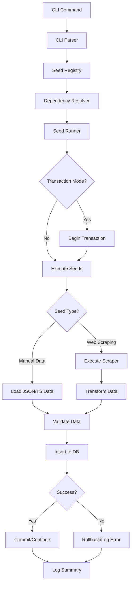

# Design Document

## Overview

The database seeding system provides a CLI-driven, modular approach to populating database tables with initial data. Built on top of Drizzle ORM and Bun runtime, it supports both manual data dumps and automated web scraping. The system is designed to be developer-friendly with clear conventions, automatic dependency resolution, and comprehensive error handling.

## Architecture

### High-Level Structure

```
packages/db/
├── src/
│   ├── seed/
│   │   ├── index.ts              # Main CLI entry point
│   │   ├── runner.ts             # Seed execution engine
│   │   ├── registry.ts           # Seed module registry
│   │   ├── utils/
│   │   │   ├── cli.ts            # CLI argument parsing
│   │   │   ├── logger.ts         # Logging utilities
│   │   │   ├── transaction.ts    # Transaction management
│   │   │   └── dependency.ts     # Dependency resolution
│   │   ├── modules/
│   │   │   ├── university.ts     # University seed module
│   │   │   ├── faculty.ts        # Faculty seed module
│   │   │   ├── department.ts     # Department seed module
│   │   │   └── ...               # Other seed modules
│   │   └── data/
│   │       ├── universities.json # Manual data dumps
│   │       └── ...
│   └── web-scraper/
│       ├── index.ts              # Scraper exports
│       ├── base/
│       │   ├── scraper.ts        # Base scraper class
│       │   ├── http-client.ts    # HTTP utilities
│       │   └── parser.ts         # HTML parsing utilities
│       ├── scrapers/
│       │   ├── university-scraper.ts
│       │   └── ...
│       └── transformers/
│           ├── university-transformer.ts
│           └── ...
```

### Component Interaction Flow



## Components and Interfaces

### 1. CLI Interface (`seed/utils/cli.ts`)

```typescript
interface SeedOptions {
  only?: string[]        // Seed only specified tables
  exclude?: string[]     // Exclude specified tables
  clear?: boolean        // Truncate before seeding
  dryRun?: boolean       // Simulate without DB changes
  verbose?: boolean      // Detailed logging
  noTransaction?: boolean // Disable transaction wrapping
  force?: boolean        // Skip confirmations
}

interface CLIParser {
  parse(args: string[]): SeedOptions
  showHelp(): void
  listAvailableSeeds(): void
}
```

### 2. Seed Module Interface (`seed/registry.ts`)

```typescript
interface SeedModule {
  name: string                    // Table/module name
  dependencies?: string[]         // Required parent seeds
  seed: SeedFunction             // Seeding function
  clear?: ClearFunction          // Optional cleanup function
  validate?: ValidationFunction  // Optional validation
}

type SeedFunction = (
  db: DrizzleDB,
  options: SeedOptions
) => Promise<SeedResult>

type ClearFunction = (
  db: DrizzleDB
) => Promise<void>

type ValidationFunction = (
  data: unknown[]
) => ValidationResult

interface SeedResult {
  tableName: string
  recordsInserted: number
  recordsSkipped: number
  errors: SeedError[]
}
```

### 3. Seed Runner (`seed/runner.ts`)

```typescript
interface SeedRunner {
  run(
    modules: SeedModule[],
    options: SeedOptions
  ): Promise<SeedSummary>

  runSingle(
    module: SeedModule,
    options: SeedOptions
  ): Promise<SeedResult>
}

interface SeedSummary {
  totalRecords: number
  successfulSeeds: string[]
  failedSeeds: string[]
  duration: number
  errors: SeedError[]
}
```

### 4. Web Scraper Base (`web-scraper/base/scraper.ts`)

```typescript
abstract class BaseScraper<T> {
  abstract scrape(): Promise<T[]>

  protected async fetch(url: string): Promise<string>
  protected parseHTML(html: string): Document
  protected retry<R>(
    fn: () => Promise<R>,
    maxRetries: number
  ): Promise<R>
}

interface ScraperConfig {
  baseUrl: string
  rateLimit?: number      // Requests per second
  timeout?: number        // Request timeout in ms
  retries?: number        // Max retry attempts
  headers?: Record<string, string>
}
```

### 5. Data Transformer (`web-scraper/transformers/`)

```typescript
interface DataTransformer<TInput, TOutput> {
  transform(input: TInput): TOutput
  validate(output: TOutput): boolean
}

// Example for university data
interface UniversityScraperData {
  name: string
  website: string
  location: string
  // ... raw scraped fields
}

interface UniversityDBRecord {
  name: string
  slug: string
  type: 'university'
  country: string
  city: string
  website: string
  validEmailDomains: string[]
}
```

## Data Models

### Seed Registry Entry

```typescript
interface RegistryEntry {
  module: SeedModule
  order: number          // Execution order based on dependencies
  status: 'pending' | 'running' | 'completed' | 'failed'
  result?: SeedResult
}
```

### Dependency Graph

```typescript
interface DependencyNode {
  name: string
  dependencies: string[]
  dependents: string[]
}

type DependencyGraph = Map<string, DependencyNode>
```

### Seed Data Format

```typescript
// Manual data dump format (data/universities.json)
interface UniversitySeedData {
  universities: Array<{
    name: string
    slug: string
    type: 'university' | 'high_school' | 'bootcamp' | 'coaching_center' | 'other'
    country: string
    city: string
    address?: string
    website?: string
    validEmailDomains: string[]
    logo?: string
  }>
}
```

## Correctness Properties

*A property is a characteristic or behavior that should hold true across all valid executions of a system—essentially, a formal statement about what the system should do. Properties serve as the bridge between human-readable specifications and machine-verifiable correctness guarantees.*

### Property 1: Dependency Order Preservation

*For any* set of seed modules with declared dependencies, the execution order should ensure that all dependencies of a module are seeded before the module itself is executed.

**Validates: Requirements 1.2, 1.4, 2.3, 7.1**

### Property 2: Transaction Atomicity

*For any* seed operation executed within a transaction, either all database modifications succeed and are committed, or all modifications are rolled back on failure.

**Validates: Requirements 6.1, 6.2, 6.4**

### Property 3: CLI Only Flag Filtering

*For any* seed command with `--only` flag specifying table names, only the specified tables (and their dependencies) should be seeded.

**Validates: Requirements 1.1, 5.1**

### Property 4: CLI Exclude Flag Filtering

*For any* seed command with `--exclude` flag specifying table names, all tables except the specified ones should be seeded.

**Validates: Requirements 5.2**

### Property 5: Idempotent Seeding

*For any* seed module executed multiple times with the same data, the database state should be consistent (either through upsert logic or duplicate detection).

**Validates: Requirements 3.3**

### Property 6: Dry Run Non-Modification

*For any* seed operation executed with `--dry-run` flag, no database modifications should occur.

**Validates: Requirements 5.4**

### Property 7: Clear Flag Cleanup

*For any* seed operation with `--clear` flag, target tables should be empty before new data is inserted.

**Validates: Requirements 5.3**

### Property 8: Error Isolation

*For any* seed module that fails during execution, other independent seed modules should continue executing unless in strict mode.

**Validates: Requirements 2.5**

### Property 9: Module Auto-Discovery

*For any* valid seed module file added to the modules directory, the seeding system should automatically detect and register it without configuration changes.

**Validates: Requirements 2.1, 2.4**

### Property 10: Seed Function Execution

*For any* registered seed module with a seed function, that function should be invoked during seeding operations.

**Validates: Requirements 2.2**

### Property 11: Data Validation Before Insertion

*For any* seed data, all required fields must be present and valid before database insertion occurs.

**Validates: Requirements 3.4, 7.4**

### Property 12: Unique Constraint Respect

*For any* seed data with unique constraints, no duplicate values should be generated or inserted.

**Validates: Requirements 7.2**

### Property 13: Scraper Data Transformation

*For any* scraped data, the transformation pipeline should convert raw data into valid database records matching the schema.

**Validates: Requirements 3.2, 4.4**

### Property 14: Retry with Exponential Backoff

*For any* scraper encountering rate limiting, retry attempts should occur with exponentially increasing delays.

**Validates: Requirements 4.2**

### Property 15: Pagination Support

*For any* multi-page scraping operation, all pages should be processed and combined into the final dataset.

**Validates: Requirements 4.3**

### Property 16: Transaction Disabled Mode

*For any* seed operation with `--no-transaction` flag, no transaction wrapping should occur.

**Validates: Requirements 6.3**

### Property 17: Timestamp Field Realism

*For any* generated timestamp field, the date should fall within realistic and appropriate ranges.

**Validates: Requirements 7.3**

### Property 18: Optional Field Distribution

*For any* optional field in seed data, the presence or absence of values should follow realistic distributions.

**Validates: Requirements 7.5**

### Property 19: Verbose Logging Output

*For any* seed operation with `--verbose` flag, more detailed logging information should be produced compared to normal mode.

**Validates: Requirements 5.5**

### Property 20: Summary Information Completeness

*For any* completed seed operation, the summary should contain record counts for all seeded tables.

**Validates: Requirements 1.5**

## Error Handling

### Error Types

```typescript
class SeedError extends Error {
  constructor(
    public module: string,
    public phase: 'validation' | 'execution' | 'cleanup',
    message: string,
    public cause?: Error
  ) {
    super(message)
  }
}

class DependencyError extends SeedError {
  constructor(
    module: string,
    public missingDependencies: string[]
  ) {
    super(
      module,
      'validation',
      `Missing dependencies: ${missingDependencies.join(', ')}`
    )
  }
}

class ValidationError extends SeedError {
  constructor(
    module: string,
    public invalidRecords: unknown[]
  ) {
    super(
      module,
      'validation',
      `${invalidRecords.length} records failed validation`
    )
  }
}
```

### Error Recovery Strategies

1. **Validation Errors**: Log invalid records and continue with valid ones
2. **Network Errors (Scraping)**: Retry with exponential backoff, fall back to manual data
3. **Database Errors**: Rollback transaction, log detailed error, exit
4. **Dependency Errors**: Halt execution, display missing dependencies
5. **Duplicate Key Errors**: Skip or update based on configuration

### Logging Strategy

```typescript
interface Logger {
  info(message: string, meta?: object): void
  warn(message: string, meta?: object): void
  error(message: string, error?: Error, meta?: object): void
  debug(message: string, meta?: object): void
  success(message: string, meta?: object): void
}

// Log levels based on --verbose flag
// Default: info, warn, error, success
// Verbose: + debug
```

## Testing Strategy

### Unit Tests

1. **CLI Parser Tests**
   - Test argument parsing for all flag combinations
   - Test help text generation
   - Test error handling for invalid flags

2. **Dependency Resolver Tests**
   - Test topological sort with various dependency graphs
   - Test circular dependency detection
   - Test missing dependency detection

3. **Data Transformer Tests**
   - Test transformation of scraped data to DB format
   - Test validation of transformed data
   - Test handling of malformed input data

4. **Transaction Manager Tests**
   - Test transaction wrapping and commit
   - Test rollback on errors
   - Test no-transaction mode

### Property-Based Tests

Property-based testing will use **fast-check** library for TypeScript. Each test should run a minimum of 100 iterations.

1. **Property Test: Dependency Order Preservation**
   - Generate random dependency graphs
   - Verify execution order respects all dependencies
   - **Feature: db-seeding-system, Property 1: Dependency Order Preservation**

2. **Property Test: Transaction Atomicity**
   - Generate random seed operations with injected failures
   - Verify database state is unchanged after rollback
   - **Feature: db-seeding-system, Property 2: Transaction Atomicity**

3. **Property Test: CLI Flag Filtering**
   - Generate random combinations of `--only` flags
   - Verify only specified modules (+ dependencies) execute
   - **Feature: db-seeding-system, Property 3: CLI Flag Filtering**

4. **Property Test: Referential Integrity**
   - Generate random parent-child relationships
   - Verify parents are always seeded before children
   - **Feature: db-seeding-system, Property 4: Referential Integrity Maintenance**

5. **Property Test: Idempotent Seeding**
   - Execute same seed module multiple times
   - Verify consistent database state
   - **Feature: db-seeding-system, Property 5: Idempotent Seeding**

6. **Property Test: Dry Run Non-Modification**
   - Execute seeds with `--dry-run` flag
   - Verify database record counts remain unchanged
   - **Feature: db-seeding-system, Property 6: Dry Run Non-Modification**

### Integration Tests

1. **End-to-End Seeding Test**
   - Seed all modules in test database
   - Verify record counts and relationships
   - Verify data integrity constraints

2. **Web Scraper Integration Test**
   - Test scraper with mock HTTP responses
   - Verify data transformation pipeline
   - Test error handling and retries

3. **CLI Integration Test**
   - Test full CLI workflow from command to completion
   - Test various flag combinations
   - Test error scenarios and user feedback

### Testing Framework Configuration

Using Bun's built-in test runner:

```typescript
// Run tests with Bun
// bun test

// Example test file: seed/__tests__/dependency.test.ts
import { describe, test, expect } from 'bun:test'
import { DependencyResolver } from '../utils/dependency'

describe('DependencyResolver', () => {
  test('should resolve dependencies in correct order', () => {
    // Test implementation
  })
})
```

## Implementation Notes

### Package Dependencies

Add to `packages/db/package.json`:

```json
{
  "dependencies": {
    "cheerio": "^1.0.0",        // HTML parsing
    "commander": "^12.0.0",      // CLI framework
    "chalk": "^5.3.0",           // Terminal colors
    "ora": "^8.0.0",             // Loading spinners
    "p-limit": "^5.0.0",         // Concurrency control
    "csv-parse": "^5.5.6"        // CSV parsing
  },
  "devDependencies": {
    "fast-check": "^3.15.0",     // Property-based testing
    "@types/cheerio": "^0.22.35",
    "@types/bun": "latest"       // Bun type definitions
  },
  "scripts": {
    "seed": "bun run src/seed/index.ts",
    "seed:dev": "bun run src/seed/index.ts --verbose",
    "test": "bun test"
  }
}
```

### CLI Usage Examples

```bash
# Seed all tables
bun db:seed

# Seed only universities
bun db:seed --only university

# Seed universities and faculties
bun db:seed --only university,faculty

# Seed all except expenses
bun db:seed --exclude expenses

# Clear and reseed universities
bun db:seed --only university --clear

# Dry run to see what would be seeded
bun db:seed --dry-run --verbose

# Force seed without confirmations
bun db:seed --clear --force
```

### Seed Module Template

```typescript
// packages/db/src/seed/modules/university.ts
import type { SeedModule } from '../registry'
import { institution } from '../../schema/institution'
import universitiesData from '../data/universities.json'
import { UniversityScraper } from '../../web-scraper/scrapers/university-scraper'

export const universitySeed: SeedModule = {
  name: 'university',
  dependencies: [], // No dependencies

  async seed(db, options) {
    const startTime = Date.now()
    let data = universitiesData.universities

    // Use web scraper if configured
    if (options.useScraper) {
      const scraper = new UniversityScraper()
      const scrapedData = await scraper.scrape()
      data = [...data, ...scrapedData]
    }

    // Remove duplicates by slug
    const uniqueData = Array.from(
      new Map(data.map(u => [u.slug, u])).values()
    )

    let inserted = 0
    let skipped = 0
    const errors = []

    for (const university of uniqueData) {
      try {
        await db.insert(institution).values(university)
          .onConflictDoNothing()
        inserted++
      } catch (error) {
        skipped++
        errors.push({ record: university, error })
      }
    }

    return {
      tableName: 'institution',
      recordsInserted: inserted,
      recordsSkipped: skipped,
      errors,
      duration: Date.now() - startTime
    }
  },

  async clear(db) {
    await db.delete(institution)
  }
}
```

### Web Scraper Example

```typescript
// packages/db/src/web-scraper/scrapers/university-scraper.ts
import { BaseScraper } from '../base/scraper'
import { UniversityTransformer } from '../transformers/university-transformer'

export class UniversityScraper extends BaseScraper<UniversityDBRecord> {
  constructor() {
    super({
      baseUrl: 'https://example.com/universities',
      rateLimit: 2, // 2 requests per second
      timeout: 10000,
      retries: 3
    })
  }

  async scrape(): Promise<UniversityDBRecord[]> {
    const html = await this.fetch('/list')
    const $ = this.parseHTML(html)
    const transformer = new UniversityTransformer()

    const universities: UniversityDBRecord[] = []

    $('.university-card').each((_, element) => {
      const rawData = {
        name: $(element).find('.name').text(),
        website: $(element).find('.website').attr('href'),
        location: $(element).find('.location').text()
      }

      const transformed = transformer.transform(rawData)
      if (transformer.validate(transformed)) {
        universities.push(transformed)
      }
    })

    return universities
  }
}
```

## Performance Considerations

1. **Batch Inserts**: Use Drizzle's batch insert for large datasets
2. **Connection Pooling**: Reuse database connections across seeds
3. **Parallel Execution**: Run independent seeds concurrently with p-limit
4. **Memory Management**: Stream large datasets instead of loading all in memory
5. **Rate Limiting**: Respect rate limits when web scraping

## Security Considerations

1. **SQL Injection**: Use parameterized queries (Drizzle handles this)
2. **Scraping Ethics**: Respect robots.txt and rate limits
3. **Data Validation**: Validate all external data before insertion
4. **Environment Variables**: Store sensitive scraper credentials in .env
5. **Transaction Isolation**: Use appropriate isolation levels for concurrent seeding
