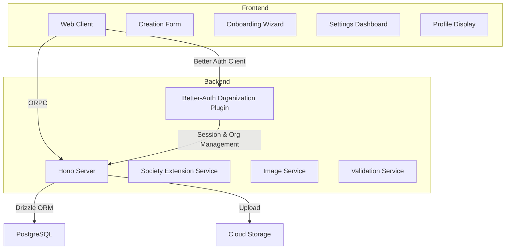

# Design Document: Society Creation and Onboarding

## Overview

The Society Creation and Onboarding system enables verified students to create and configure student organizations (societies) within the Rovierr platform. The system consists of three main components:

1. **Enhanced Creation Form**: A comprehensive form that captures basic society information and social links during initial creation
2. **Guided Onboarding Flow**: A multi-step wizard that helps society creators complete their profile with visual branding and additional details
3. **Settings Dashboard**: An administrative interface for ongoing society management

The design emphasizes progressive disclosure, allowing users to create a society quickly while providing optional steps to enrich the profile over time.

### Better-Auth Integration Strategy

This system leverages **Better-Auth's organization plugin** for core organization functionality, significantly reducing implementation complexity:

**What Better-Auth Provides:**
- Organization CRUD operations (create, update, delete)
- Automatic slug generation from organization name
- Member management with role-based access control (owner, admin, member)
- Invitation system with email notifications
- Organization listing and retrieval
- Active organization tracking per user session
- Built-in permission checks

**What We Extend:**
- Additional fields for society-specific data (social links, branding, additional details)
- Society-specific validation (e.g., university requirement for official organizations)
- Profile completion tracking
- Onboarding flow state management
- Banner image upload (logo handled by Better-Auth)
- Enriched society data retrieval combining organization + society fields

**Implementation Approach:**
1. Configure Better-Auth organization plugin with `additionalFields` for society-specific data
2. Use Better-Auth client methods (`authClient.organization.*`) for core operations
3. Create minimal ORPC endpoints only for society-specific field updates
4. Leverage Better-Auth's role system for authorization (president = owner role)

## Architecture

### System Components



### Data Flow

1. **Society Creation Flow**:
   - User submits creation form → Validation → Better-Auth organization.create (handles org + president role) → Update with society-specific fields → Redirect to onboarding

2. **Onboarding Flow**:
   - Load current society data → Display step wizard → User completes steps → Update society-specific fields per step → Mark onboarding complete → Redirect to dashboard

3. **Settings Update Flow**:
   - Load society data → User edits fields → Validate changes → Update organization via Better-Auth or society-specific fields via ORPC → Invalidate cache → Show success feedback

4. **Image Upload Flow**:
   - User selects image → Client-side validation → Upload to cloud storage → Get URL → Update organization metadata → Display new image

## API Usage Patterns

### Better-Auth Organization Methods

**Creating a Society:**
```typescript
// Frontend - using Better-Auth client
const { data, error } = await authClient.organization.create({
  name: "Computer Science Society",
  slug: "cs-society", // Optional, auto-generated if not provided
  logo: logoUrl, // Optional
  // Society-specific additional fields
  description: "A community for CS students",
  organizationType: "student",
  universityId: "uni-123",
  tags: ["technology", "programming"],
  instagram: "@cs_society",
  facebook: "https://facebook.com/cs-society",
  // ... other social links and fields
})
```

**Updating Organization Core Fields:**
```typescript
// Update name, slug, logo via Better-Auth
await authClient.organization.update({
  organizationId: "org-123",
  name: "New Society Name",
  logo: newLogoUrl,
})
```

**Managing Members:**
```typescript
// Invite a member
await authClient.organization.inviteMember({
  email: "student@university.edu",
  role: "member",
  organizationId: "org-123",
})

// Remove a member
await authClient.organization.removeMember({
  memberIdOrEmail: "user@example.com",
  organizationId: "org-123",
})

// List organization members (via Better-Auth session)
const { data: members } = await authClient.organization.listMembers({
  organizationId: "org-123",
})
```

**Retrieving Organizations:**
```typescript
// List user's organizations
const { data: orgs } = await authClient.organization.listOrganizations()

// Set active organization
await authClient.organization.setActive({
  organizationId: "org-123",
})
```

### ORPC Society-Specific Methods

**Retrieving Enriched Society Data:**
```typescript
// Get society with all fields (organization + society-specific)
const { data: society } = await orpc.society.getById.query({ id: "org-123" })
const { data: society } = await orpc.society.getBySlug.query({ slug: "cs-society" })
```

**Updating Society-Specific Fields:**
```typescript
// Update social links, branding, additional details
await orpc.society.updateFields.mutate({
  organizationId: "org-123",
  data: {
    banner: bannerUrl,
    instagram: "@new_handle",
    foundingYear: 2020,
    goals: "Our mission is...",
    primaryColor: "#FF5733",
  },
})
```

**Uploading Banner:**
```typescript
// Banner is society-specific (logo handled by Better-Auth)
const { data } = await orpc.society.uploadBanner.mutate({
  organizationId: "org-123",
  file: bannerFile,
})
```

**Completing Onboarding:**
```typescript
await orpc.society.completeOnboarding.mutate({
  organizationId: "org-123",
})
```

### Authorization Pattern

**Checking User Role:**
```typescript
// Better-Auth provides role information in session
const session = await authClient.getSession()
const userOrgs = session.user.organizations // Array of user's org memberships

const isPresident = userOrgs.some(
  (org) => org.id === "org-123" && org.role === "owner"
)
```

**Server-Side Permission Check:**
```typescript
// In ORPC handler
const session = await getSession(request)
const member = await db.query.members.findFirst({
  where: and(
    eq(members.organizationId, organizationId),
    eq(members.userId, session.user.id)
  ),
})

if (!member || member.role !== "owner") {
  throw new Error("Unauthorized: Only presidents can update settings")
}
```

## Components and Interfaces

### Frontend Components

#### 1. Society Creation Form (`/spaces/societies/create`)

**Component Structure**:
```typescript
<SocietyCreationForm>
  <FormSection title="Basic Information">
    <TextField name="name" />
    <TextareaField name="description" />
    <SelectField name="universityId" />
    <ToggleField name="organizationType" />
    <TagsField name="tags" />
  </FormSection>

  <FormSection title="Social Links">
    <SocialLinkField platform="instagram" />
    <SocialLinkField platform="facebook" />
    <SocialLinkField platform="twitter" />
    <SocialLinkField platform="linkedin" />
    <SocialLinkField platform="whatsapp" />
    <SocialLinkField platform="telegram" />
    <SocialLinkField platform="website" />
  </FormSection>

  <FormActions>
    <Button type="submit">Create Society</Button>
  </FormActions>
</SocietyCreationForm>
```

**Key Features**:
- TanStack Form with Zod validation
- Conditional university requirement based on organization type
- Real-time validation feedback
- Social link format helpers
- Tag input with autocomplete

#### 2. Onboarding Wizard (`/spaces/societies/mine/[societyId]/onboarding`)

**Component Structure**:
```typescript
<OnboardingWizard>
  <ProgressIndicator currentStep={step} totalSteps={3} />

  <StepContent>
    {step === 1 && (
      <VisualBrandingStep>
        <ImageUpload type="logo" />
        <ImageUpload type="banner" />
        <ColorPicker name="primaryColor" />
      </VisualBrandingStep>
    )}

    {step === 2 && (
      <ContactInformationStep>
        <SocialLinksForm />
      </ContactInformationStep>
    )}

    {step === 3 && (
      <AdditionalDetailsStep>
        <YearPicker name="foundingYear" />
        <TextField name="meetingSchedule" />
        <TextareaField name="membershipRequirements" />
        <TextareaField name="goals" />
      </AdditionalDetailsStep>
    )}
  </StepContent>

  <WizardActions>
    <Button onClick={handleSkip}>Skip</Button>
    <Button onClick={handleNext}>Next</Button>
    <Button onClick={handleFinish}>Finish Later</Button>
  </WizardActions>
</OnboardingWizard>
```

**Key Features**:
- Multi-step wizard with progress tracking
- Auto-save on step completion
- Skip functionality for optional steps
- Resume from last incomplete step
- Mobile-responsive design

#### 3. Public Society Profile Display (`/societies/[societyId]`)

**Component Structure**:
```typescript
<PublicSocietyProfile>
  <ProfileHeader>
    <BannerImage src={society.banner} />
    <ProfileInfo>
      <LogoAvatar src={society.logo} />
      <SocietyName>{society.name}</SocietyName>
      <OrganizationTypeBadge type={society.organizationType} />
      <MemberCount count={society.memberCount} />
    </ProfileInfo>
  </ProfileHeader>

  <ProfileContent>
    <AboutSection>
      <Description>{society.description}</Description>
      <Tags tags={society.tags} />
      <UniversityAffiliation university={society.university} />
    </AboutSection>

    <SocialLinksSection links={society.socialLinks} />

    {society.goals && (
      <GoalsSection content={society.goals} />
    )}

    {society.meetingSchedule && (
      <MeetingInfoSection schedule={society.meetingSchedule} />
    )}

    {society.membershipRequirements && (
      <MembershipSection requirements={society.membershipRequirements} />
    )}

    <JoinButton societyId={society.id} />
  </ProfileContent>
</PublicSocietyProfile>
```

**Key Features**:
- Publicly accessible at root level (`/societies/[societyId]`)
- Responsive banner and logo display
- Conditional rendering of optional sections
- Social link icons with external links
- Tag badges with filtering capability
- Default fallbacks for missing images
- Join button for non-members

#### 3b. Member Society Dashboard (`/spaces/societies/mine/[societyId]`)

**Component Structure**:
```typescript
<MemberSocietyDashboard>
  <SocietyNavigation>
    <NavItem href="/spaces/societies/mine/[societyId]">Dashboard</NavItem>
    <NavItem href="/spaces/societies/mine/[societyId]/events">Events</NavItem>
    <NavItem href="/spaces/societies/mine/[societyId]/members">Members</NavItem>
    {isPresident && (
      <NavItem href="/spaces/societies/mine/[societyId]/settings">Settings</NavItem>
    )}
  </SocietyNavigation>

  <DashboardContent>
    <ProfileCompletionCard completion={society.profileCompletionPercentage} />
    <RecentActivityFeed />
    <UpcomingEvents />
    <MemberHighlights />
  </DashboardContent>
</MemberSocietyDashboard>
```

**Key Features**:
- Private member-only view at `/spaces/societies/mine/[societyId]`
- Navigation to society features
- Profile completion tracking
- Activity feed and updates
- Quick access to settings (for presidents)
- Dashboard shows member-specific content

#### 4. Settings Dashboard (`/spaces/societies/mine/[societyId]/settings`)

**Component Structure**:
```typescript
<SettingsDashboard>
  <SettingsTabs>
    <Tab id="general">General</Tab>
    <Tab id="branding">Branding</Tab>
    <Tab id="social">Social Links</Tab>
    <Tab id="details">Details</Tab>
  </SettingsTabs>

  <TabContent>
    {activeTab === 'general' && (
      <GeneralSettings>
        <TextField name="name" />
        <TextareaField name="description" />
        <TagsField name="tags" />
        <ToggleField name="organizationType" />
        <SelectField name="visibility" />
      </GeneralSettings>
    )}

    {activeTab === 'branding' && (
      <BrandingSettings>
        <ImageUpload type="logo" />
        <ImageUpload type="banner" />
        <ColorPicker name="primaryColor" />
      </BrandingSettings>
    )}

    {activeTab === 'social' && (
      <SocialLinksSettings>
        <SocialLinkField platform="instagram" />
        <SocialLinkField platform="facebook" />
        {/* ... other platforms */}
      </SocialLinksSettings>
    )}

    {activeTab === 'details' && (
      <DetailsSettings>
        <YearPicker name="foundingYear" />
        <TextField name="meetingSchedule" />
        <TextareaField name="membershipRequirements" />
        <TextareaField name="goals" />
      </DetailsSettings>
    )}
  </TabContent>
</SettingsDashboard>
```

**Key Features**:
- Tabbed interface for organized settings
- Auto-save on field blur
- Permission-based access control
- Toast notifications for feedback
- Validation error display

### Backend Services

#### 1. Society Extension Service

**Responsibilities**:
- Extend Better-Auth organizations with society-specific fields
- Update society-specific information (social links, branding, additional details)
- Retrieve enriched society data
- Manage onboarding state
- Calculate profile completion

**Key Methods**:
```typescript
interface SocietyExtensionService {
  // Extends Better-Auth organization with society fields
  createSociety(orgId: string, data: SocietyExtensionInput): Promise<void>

  // Updates society-specific fields only
  updateSocietyFields(orgId: string, data: UpdateSocietyFieldsInput): Promise<void>

  // Retrieves organization with society fields
  getEnrichedSociety(orgId: string): Promise<EnrichedSociety | null>

  calculateCompletion(society: EnrichedSociety): number
  markOnboardingComplete(orgId: string): Promise<void>
}
```

**Note**: Core organization operations (create, update name/slug, delete, member management) are handled by Better-Auth's organization plugin.

#### 2. Image Service

**Responsibilities**:
- Upload images to cloud storage
- Validate image files
- Generate optimized versions
- Delete images from storage
- Generate signed URLs

**Key Methods**:
```typescript
interface ImageService {
  upload(file: File, type: 'logo' | 'banner'): Promise<string>
  delete(url: string): Promise<void>
  validate(file: File, constraints: ImageConstraints): ValidationResult
  optimize(file: File): Promise<File>
}
```

#### 3. Validation Service

**Responsibilities**:
- Validate social link formats
- Sanitize user input
- Check uniqueness constraints
- Validate image files

**Key Methods**:
```typescript
interface ValidationService {
  validateSocialLink(platform: SocialPlatform, value: string): boolean
  sanitizeInput(input: string): string
  checkUniqueName(name: string, universityId?: string): Promise<boolean>
  validateImage(file: File, type: 'logo' | 'banner'): ValidationResult
}
```

## Data Models

### Extended Organization Schema

Better-Auth's organization plugin provides the base organization table. We extend it with society-specific fields using Better-Auth's `additionalFields` configuration:

```typescript
// Better-Auth organization plugin configuration with additional fields
export const auth = betterAuth({
  plugins: [
    organization({
      schema: {
        organization: {
          additionalFields: {
            // Society-specific fields
            description: {
              type: "string",
              required: true,
              input: true,
            },
            banner: {
              type: "string",
              required: false,
              input: true,
            },
            universityId: {
              type: "string",
              required: false,
              input: true,
              references: {
                model: "university",
                field: "id",
              },
            },
            organizationType: {
              type: "string",
              required: true,
              input: true,
            },
            tags: {
              type: "string",
              required: false,
              input: true,
            },
            // Social links
            instagram: {
              type: "string",
              required: false,
              input: true,
            },
            facebook: {
              type: "string",
              required: false,
              input: true,
            },
            twitter: {
              type: "string",
              required: false,
              input: true,
            },
            linkedin: {
              type: "string",
              required: false,
              input: true,
            },
            whatsapp: {
              type: "string",
              required: false,
              input: true,
            },
            telegram: {
              type: "string",
              required: false,
              input: true,
            },
            website: {
              type: "string",
              required: false,
              input: true,
            },
            // Additional details
            foundingYear: {
              type: "number",
              required: false,
              input: true,
            },
            meetingSchedule: {
              type: "string",
              required: false,
              input: true,
            },
            membershipRequirements: {
              type: "string",
              required: false,
              input: true,
            },
            goals: {
              type: "string",
              required: false,
              input: true,
            },
            // Branding
            primaryColor: {
              type: "string",
              required: false,
              input: true,
            },
            // State tracking
            onboardingCompleted: {
              type: "boolean",
              required: false,
              defaultValue: false,
              input: false,
            },
            profileCompletionPercentage: {
              type: "number",
              required: false,
              defaultValue: 0,
              input: false,
            },
          },
        },
      },
    }),
  ],
});
```

**Note**: Better-Auth already provides:
- `id`, `name`, `slug`, `logo`, `createdAt`, `metadata` fields
- Organization CRUD operations
- Member management with roles (owner, admin, member)
- Invitation system

### TypeScript Types

```typescript
// Core types
type OrganizationType = 'student' | 'official'

type SocialPlatform =
  | 'instagram'
  | 'facebook'
  | 'twitter'
  | 'linkedin'
  | 'whatsapp'
  | 'telegram'
  | 'website'

interface SocialLinks {
  instagram?: string
  facebook?: string
  twitter?: string
  linkedin?: string
  whatsapp?: string
  telegram?: string
  website?: string
}

// Extended from Better-Auth Organization type
interface Society {
  // Better-Auth organization fields
  id: string
  name: string
  slug: string
  logo?: string
  createdAt: Date
  metadata?: Record<string, any>

  // Society-specific fields
  description: string
  banner?: string
  universityId?: string
  organizationType: OrganizationType
  tags: string[]
  socialLinks: SocialLinks
  foundingYear?: number
  meetingSchedule?: string
  membershipRequirements?: string
  goals?: string
  primaryColor?: string
  onboardingCompleted: boolean
  profileCompletionPercentage: number

  // Computed fields
  memberCount: number
}

// Input types for Better-Auth organization.create
interface CreateSocietyInput {
  // Better-Auth required fields
  name: string
  slug?: string // Auto-generated if not provided

  // Society-specific fields
  description: string
  universityId?: string
  organizationType: OrganizationType
  tags?: string[]
  instagram?: string
  facebook?: string
  twitter?: string
  linkedin?: string
  whatsapp?: string
  telegram?: string
  website?: string
}

// Input types for updating society-specific fields
interface UpdateSocietyFieldsInput {
  description?: string
  universityId?: string
  organizationType?: OrganizationType
  tags?: string[]
  banner?: string
  instagram?: string
  facebook?: string
  twitter?: string
  linkedin?: string
  whatsapp?: string
  telegram?: string
  website?: string
  foundingYear?: number
  meetingSchedule?: string
  membershipRequirements?: string
  goals?: string
  primaryColor?: string
}

// Validation constraints
interface ImageConstraints {
  maxSize: number // in bytes
  formats: string[]
  minWidth: number
  minHeight: number
}

const LOGO_CONSTRAINTS: ImageConstraints = {
  maxSize: 5 * 1024 * 1024, // 5MB
  formats: ['image/jpeg', 'image/png', 'image/webp'],
  minWidth: 200,
  minHeight: 200,
}

const BANNER_CONSTRAINTS: ImageConstraints = {
  maxSize: 10 * 1024 * 1024, // 10MB
  formats: ['image/jpeg', 'image/png', 'image/webp'],
  minWidth: 1200,
  minHeight: 400,
}
```

### ORPC Contracts

Since Better-Auth handles core organization operations, our ORPC contracts focus on society-specific extensions:

```typescript
// Zod schemas for validation
const socialLinksSchema = z.object({
  instagram: z.string().regex(/^@?[\w.]+$/).optional(),
  facebook: z.string().url().optional(),
  twitter: z.string().regex(/^@?[\w]+$/).optional(),
  linkedin: z.string().url().optional(),
  whatsapp: z.string().optional(), // phone or link
  telegram: z.string().optional(), // username or link
  website: z.string().url().optional(),
})

// Schema for creating a society (used with Better-Auth organization.create)
const createSocietySchema = z.object({
  name: z.string().min(1).max(100),
  slug: z.string().optional(), // Auto-generated if not provided
  description: z.string().min(1).max(1000),
  universityId: z.string().optional(),
  organizationType: z.enum(['student', 'official']),
  tags: z.array(z.string()).optional(),
  instagram: z.string().regex(/^@?[\w.]+$/).optional(),
  facebook: z.string().url().optional(),
  twitter: z.string().regex(/^@?[\w]+$/).optional(),
  linkedin: z.string().url().optional(),
  whatsapp: z.string().optional(),
  telegram: z.string().optional(),
  website: z.string().url().optional(),
}).refine(
  (data) => data.organizationType !== 'official' || data.universityId,
  {
    message: 'University affiliation is required for official organizations',
    path: ['universityId'],
  }
)

// Schema for updating society-specific fields
const updateSocietyFieldsSchema = z.object({
  description: z.string().min(1).max(1000).optional(),
  universityId: z.string().optional(),
  organizationType: z.enum(['student', 'official']).optional(),
  tags: z.array(z.string()).optional(),
  banner: z.string().url().optional(),
  instagram: z.string().regex(/^@?[\w.]+$/).optional(),
  facebook: z.string().url().optional(),
  twitter: z.string().regex(/^@?[\w]+$/).optional(),
  linkedin: z.string().url().optional(),
  whatsapp: z.string().optional(),
  telegram: z.string().optional(),
  website: z.string().url().optional(),
  foundingYear: z.number().int().min(1800).max(new Date().getFullYear()).optional(),
  meetingSchedule: z.string().max(200).optional(),
  membershipRequirements: z.string().max(500).optional(),
  goals: z.string().max(1000).optional(),
  primaryColor: z.string().regex(/^#[0-9A-F]{6}$/i).optional(),
})

// ORPC contract - minimal, as Better-Auth handles most operations
export const societyContract = {
  // Get enriched society data (organization + society fields)
  getById: {
    input: z.object({ id: z.string() }),
    output: societySchema.nullable(),
  },
  getBySlug: {
    input: z.object({ slug: z.string() }),
    output: societySchema.nullable(),
  },

  // Update society-specific fields only
  updateFields: {
    input: z.object({
      organizationId: z.string(),
      data: updateSocietyFieldsSchema,
    }),
    output: societySchema,
  },

  // Image upload (logo handled by Better-Auth, banner is society-specific)
  uploadBanner: {
    input: z.object({
      organizationId: z.string(),
      file: z.instanceof(File),
    }),
    output: z.object({ url: z.string() }),
  },

  // Mark onboarding as complete
  completeOnboarding: {
    input: z.object({ organizationId: z.string() }),
    output: z.object({ success: z.boolean() }),
  },
}
```

**Note**:
- Organization creation uses Better-Auth's `authClient.organization.create()` with additional fields
- Organization updates (name, slug, logo) use Better-Auth's update methods
- Member management uses Better-Auth's invitation and member methods
- Our ORPC contracts only handle society-specific field updates


## Correctness Properties

*A property is a characteristic or behavior that should hold true across all valid executions of a system-essentially, a formal statement about what the system should do. Properties serve as the bridge between human-readable specifications and machine-verifiable correctness guarantees.*

### Property 1: Form data collection completeness

*For any* valid form input submitted to the creation form, the collected form state should contain all the fields that were provided in the input with their correct values.

**Validates: Requirements 1.2**

### Property 2: Official organization requires university affiliation

*For any* form submission where organizationType is "official", the validation should fail if and only if universityId is not provided.

**Validates: Requirements 1.3**

### Property 3: Student society allows optional university affiliation

*For any* form submission where organizationType is "student", the validation should pass regardless of whether universityId is provided (assuming all other required fields are valid).

**Validates: Requirements 1.4**

### Property 4: Society creation round-trip consistency

*For any* valid society creation input, creating a society and then immediately retrieving it by ID should return a society object containing all the provided information.

**Validates: Requirements 1.5**

### Property 5: Creator receives president role

*For any* society creation, querying the membership records for the creator should return a record with role "president" and full permissions.

**Validates: Requirements 1.6**

### Property 6: Step completion persists data

*For any* onboarding step completion with valid data, saving the step and then retrieving the society should show the updated fields from that step.

**Validates: Requirements 2.6**

### Property 7: Skip preserves existing data

*For any* onboarding step, clicking skip should not modify any society fields and should advance to the next step.

**Validates: Requirements 2.7**

### Property 8: Onboarding resume from last incomplete step

*For any* partially completed onboarding session, returning to the onboarding flow should display the first step that has not been completed.

**Validates: Requirements 2.9**

### Property 9: Profile displays all society information

*For any* society with complete data, the profile page should render all the specified fields (name, description, tags, member count, university, organization type).

**Validates: Requirements 3.5**

### Property 10: Social links conditional rendering

*For any* society, a social link icon should be rendered if and only if that social link field is set in the society data.

**Validates: Requirements 3.6, 3.8**

### Property 11: Additional details conditional rendering

*For any* society, an additional details section (goals, meeting info, membership) should be rendered if and only if that field is set in the society data.

**Validates: Requirements 3.7**

### Property 12: Non-president access denial

*For any* user who is not a president of a society, attempting to access that society's settings should result in an access denied response.

**Validates: Requirements 4.2**

### Property 13: Settings validation enforcement

*For any* settings update with invalid data, the update should fail and return validation errors describing the issues.

**Validates: Requirements 4.4**

### Property 14: Settings update persistence

*For any* valid settings update, saving the changes and then retrieving the society should show the updated values.

**Validates: Requirements 4.5**

### Property 15: Settings validation error display

*For any* settings update that fails validation, the response should include field-specific error messages for each invalid field.

**Validates: Requirements 4.7**

### Property 16: Name change updates slug

*For any* society name update, the slug should be automatically updated to a URL-safe version of the new name.

**Validates: Requirements 4.8**

### Property 17: Logo validation enforcement

*For any* logo upload, the system should reject files that exceed 5MB, are not in jpg/png/webp format, or have dimensions smaller than 200x200 pixels.

**Validates: Requirements 5.1**

### Property 18: Banner validation enforcement

*For any* banner upload, the system should reject files that exceed 10MB, are not in jpg/png/webp format, or have dimensions smaller than 1200x400 pixels.

**Validates: Requirements 5.2**

### Property 19: Image upload persistence

*For any* valid image upload, the upload should succeed and the society record should be updated with the new image URL.

**Validates: Requirements 5.3, 5.4**

### Property 20: Image removal cleanup

*For any* image removal request, the image should be deleted from cloud storage and the society record should have that image field set to null.

**Validates: Requirements 5.6**

### Property 21: Instagram handle validation

*For any* Instagram handle input, the validation should pass if and only if it matches the Instagram username format (alphanumeric, dots, underscores, optional @ prefix).

**Validates: Requirements 6.1**

### Property 22: Facebook URL validation

*For any* Facebook URL input, the validation should pass if and only if it is a properly formatted URL.

**Validates: Requirements 6.2**

### Property 23: Twitter handle validation

*For any* Twitter handle input, the validation should pass if and only if it matches the Twitter username format (alphanumeric, underscores, optional @ prefix).

**Validates: Requirements 6.3**

### Property 24: LinkedIn URL validation

*For any* LinkedIn URL input, the validation should pass if and only if it is a properly formatted URL.

**Validates: Requirements 6.4**

### Property 25: WhatsApp contact validation

*For any* WhatsApp contact input, the validation should pass if and only if it is either a valid phone number or a valid WhatsApp link.

**Validates: Requirements 6.5**

### Property 26: Telegram link validation

*For any* Telegram link input, the validation should pass if and only if it matches a valid Telegram username or group link format.

**Validates: Requirements 6.6**

### Property 27: Website URL validation

*For any* website URL input, the validation should pass if and only if it is a properly formatted URL with a protocol (http:// or https://).

**Validates: Requirements 6.7**

### Property 28: Profile completion calculation accuracy

*For any* society state, the calculated profile completion percentage should match the formula: basic info (30%) + visual branding (20%) + social links (20%) + additional details (20%) + member count (10%).

**Validates: Requirements 7.5**

### Property 29: Society query includes all fields

*For any* society retrieval by ID or slug, the returned object should include all fields including all social link fields.

**Validates: Requirements 8.2**

### Property 30: Input sanitization on update

*For any* society update, all text input fields should be sanitized to remove potentially malicious content before storage.

**Validates: Requirements 8.3**

### Property 31: Contract validation error messages

*For any* ORPC contract validation failure, the error response should include descriptive messages explaining what validation rules were violated.

**Validates: Requirements 9.5**

## Error Handling

### Validation Errors

**Client-Side Validation**:
- Form fields validate on blur and on submit
- Real-time feedback for format errors (social links, URLs)
- Character count indicators for text fields
- File size and format validation before upload

**Server-Side Validation**:
- All inputs validated against Zod schemas
- Detailed error messages returned for each field
- HTTP 400 for validation errors with structured error response:

```typescript
{
  error: 'VALIDATION_ERROR',
  message: 'Invalid input data',
  fields: {
    name: ['Name must be between 1 and 100 characters'],
    instagram: ['Invalid Instagram username format']
  }
}
```

### Authorization Errors

**Access Control**:
- Only verified students can create societies
- Only presidents can access settings
- HTTP 403 for unauthorized access with clear message:

```typescript
{
  error: 'FORBIDDEN',
  message: 'You do not have permission to access this resource'
}
```

### Upload Errors

**Image Upload Failures**:
- File size exceeded: "Image must be under 5MB"
- Invalid format: "Only JPG, PNG, and WebP formats are supported"
- Dimension requirements: "Logo must be at least 200x200 pixels"
- Upload failure: "Failed to upload image. Please try again."

**Error Recovery**:
- Retry mechanism for transient failures
- Rollback on partial failures
- Clear error messages with actionable guidance

### Database Errors

**Constraint Violations**:
- Unique name conflict: "A society with this name already exists at your university"
- Unique slug conflict: Automatic slug generation with suffix
- Foreign key violations: "Selected university does not exist"

**Connection Errors**:
- Retry with exponential backoff
- Fallback to cached data when appropriate
- User-friendly error messages

### State Management Errors

**Onboarding State**:
- Resume from last saved step on error
- Auto-save prevents data loss
- Clear indication of save status

**Form State**:
- Preserve form data on validation errors
- Prevent duplicate submissions
- Loading states during async operations

## Testing Strategy

### Unit Testing

**Component Tests**:
- Form validation logic
- Social link format validators
- Profile completion calculator
- Slug generation utility
- Image constraint validators

**Service Tests**:
- Society CRUD operations
- Image upload/delete operations
- Permission checks
- Data sanitization

**Integration Tests**:
- Society creation flow end-to-end
- Onboarding wizard flow
- Settings update flow
- Image upload flow

### Property-Based Testing

We will use **fast-check** (JavaScript/TypeScript property-based testing library) for property-based tests. Each property-based test should run a minimum of 100 iterations.

**Property Test Implementation**:
- Each correctness property listed above will be implemented as a property-based test
- Tests will be tagged with comments referencing the design document property
- Tag format: `// Feature: society-onboarding, Property {number}: {property_text}`

**Test Generators**:
- Random society data generator (valid and invalid)
- Random social link generator (various formats)
- Random image file generator (various sizes and formats)
- Random user role generator
- Random onboarding state generator

**Property Test Examples**:

```typescript
// Feature: society-onboarding, Property 4: Society creation round-trip consistency
test('society creation round-trip', async () => {
  await fc.assert(
    fc.asyncProperty(
      societyDataArbitrary(),
      async (societyData) => {
        const created = await societyService.create(societyData)
        const retrieved = await societyService.getById(created.id)

        expect(retrieved).toMatchObject(societyData)
      }
    ),
    { numRuns: 100 }
  )
})

// Feature: society-onboarding, Property 21: Instagram handle validation
test('instagram handle validation', () => {
  fc.assert(
    fc.property(
      instagramHandleArbitrary(),
      (handle) => {
        const isValid = validateInstagramHandle(handle)
        const matchesFormat = /^@?[\w.]+$/.test(handle)

        expect(isValid).toBe(matchesFormat)
      }
    ),
    { numRuns: 100 }
  )
})
```

### End-to-End Testing

**User Flows**:
- Complete society creation and onboarding
- Update society settings
- Upload and remove images
- Navigate between society pages
- Access control verification

**Browser Testing**:
- Cross-browser compatibility (Chrome, Firefox, Safari)
- Mobile responsiveness
- Image upload on different devices

### Performance Testing

**Load Testing**:
- Society creation under load
- Image upload performance
- Profile page load times
- Settings update responsiveness

**Optimization Targets**:
- Society creation: < 2 seconds
- Settings update: < 1 second
- Profile page load: < 1.5 seconds
- Image upload: < 5 seconds for 5MB file

## Security Considerations

### Authentication and Authorization

**Access Control**:
- Verify user session before any operation
- Check student verification status for creation
- Validate president role for settings access
- Implement rate limiting on creation endpoint

### Input Validation and Sanitization

**XSS Prevention**:
- Sanitize all text inputs before storage
- Escape HTML in user-generated content
- Validate URLs to prevent javascript: protocol
- Use Content Security Policy headers

**SQL Injection Prevention**:
- Use parameterized queries (Drizzle ORM)
- Validate all input against schemas
- Never concatenate user input into queries

### Image Upload Security

**File Validation**:
- Verify file type by magic bytes, not just extension
- Scan uploaded files for malware
- Limit file sizes to prevent DoS
- Store images in isolated storage bucket

**URL Security**:
- Use signed URLs for uploads
- Implement CORS restrictions
- Validate image URLs before storage
- Prevent path traversal attacks

### Data Privacy

**Personal Information**:
- Store only necessary information
- Implement data retention policies
- Allow users to delete their societies
- Comply with GDPR/privacy regulations

### Rate Limiting

**API Protection**:
- Limit society creation: 5 per hour per user
- Limit image uploads: 10 per hour per society
- Limit settings updates: 30 per hour per society
- Implement exponential backoff for repeated failures

## Implementation Notes

### Technology Stack

**Frontend**:
- Next.js 14 with App Router
- React 19 with TypeScript
- TanStack Form for form management
- TanStack Query for data fetching
- Radix UI + ShadCN for components
- Tailwind CSS for styling

**Backend**:
- Bun runtime
- Hono framework
- Drizzle ORM with PostgreSQL
- ORPC for type-safe contracts
- Better-Auth for authentication

**Storage**:
- AWS S3 or compatible for images
- PostgreSQL for structured data
- Redis for caching (optional)

### Database Migrations

**Migration Strategy**:
- Use Drizzle Kit for schema migrations
- Add new fields with nullable constraints
- Backfill existing societies with defaults
- Create indexes for frequently queried fields

**Required Indexes**:
```sql
CREATE INDEX idx_organizations_slug ON organizations(slug);
CREATE INDEX idx_organizations_university_id ON organizations(university_id);
CREATE INDEX idx_organizations_organization_type ON organizations(organization_type);
CREATE INDEX idx_organizations_onboarding_completed ON organizations(onboarding_completed);
```

### Caching Strategy

**Cache Layers**:
- Browser cache for images (1 week)
- CDN cache for public profiles (5 minutes)
- Server cache for society data (1 minute)
- Invalidate cache on updates

### Monitoring and Logging

**Metrics to Track**:
- Society creation rate
- Onboarding completion rate
- Settings update frequency
- Image upload success rate
- Error rates by type

**Logging**:
- Log all society creations
- Log failed validations
- Log authorization failures
- Log image upload errors

### Deployment Considerations

**Feature Flags**:
- Enable onboarding wizard gradually
- A/B test different onboarding flows
- Toggle image upload feature

**Rollback Plan**:
- Database migrations are reversible
- Feature flags allow instant disable
- Image storage has versioning

### Future Enhancements

**Planned Features**:
- Bulk member import
- Society templates
- Advanced analytics dashboard
- Integration with university systems
- Mobile app support
- Event management integration

**Technical Debt**:
- Implement image optimization pipeline
- Add comprehensive audit logging
- Implement real-time collaboration
- Add advanced search and filtering
